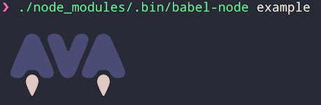

# ink-image [](https://travis-ci.org/kevva/ink-image)

> Image component for [Ink](https://github.com/vadimdemedes/ink)



In iTerm, the image will be displayed in full resolution, since iTerm has special image support.

## Install

```
$ npm install ink-image
```

## Usage

```js
import React from 'react';
import {render} from 'ink';
import Image from 'ink-image';

render(
	<Image preserveAspectRatio src='unicorn.jpg' width='50%'/>
);
```

## API

### `<Image/>`

Besides the props below, it accepts props allowed in [`terminal-image`](https://github.com/sindresorhus/terminal-image#options).

#### src

Type: `string | Buffer`

Path to an image or the image as a `Buffer`. Supports PNG images, JPEG images and animated GIFs.
